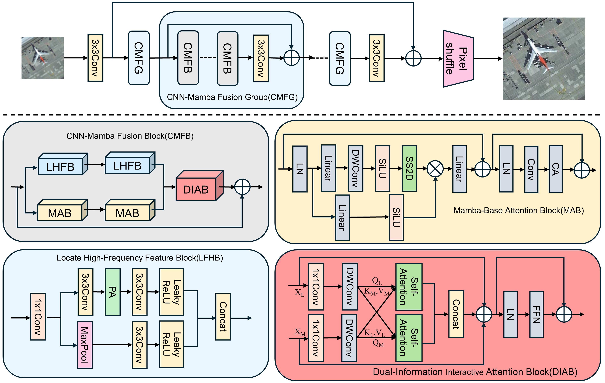

# HFMN：A Lightweight High-frequency Mamba Network for Image Super-Resolution

本仓库是HFMN的官方实现，代码使用pytorch开发

> <p align="center">
> 
> </p>

## Dependencies
- Python 3.8
- Pytorch 2.0.0
- numpy
- timm
- pip install -r requirements.txt
- python setup.py develop

## Train
Trained using DF2K
```bash
bash scripts/dist_train.sh 1 options/train/HFMN/train_HFMN_SRx2.yml
bash scripts/dist_train.sh 1 options/train/HFMN/train_HFMN_SRx3.yml
bash scripts/dist_train.sh 1 options/train/HFMN/train_HFMN_SRx4.yml
```

## Test
```bash
python inference/HFMN_infer.py --scale 2/3/4 --model_path experiments/HFMN_SRx2/models/net_g_latest.pth --folder_lq datasets/Urban100/LR_bicubic --input datasets/Urban100/HR --output results/HFMN/Urban100
```
